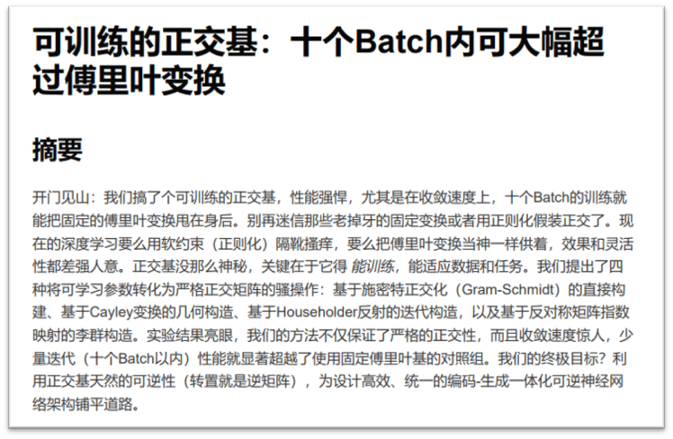
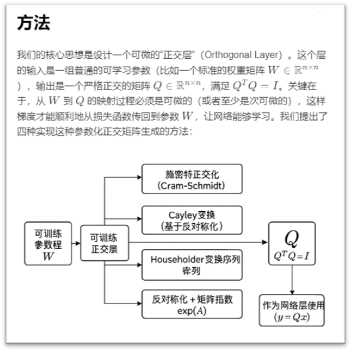
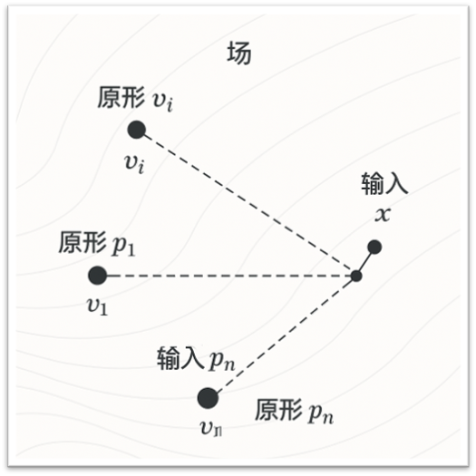
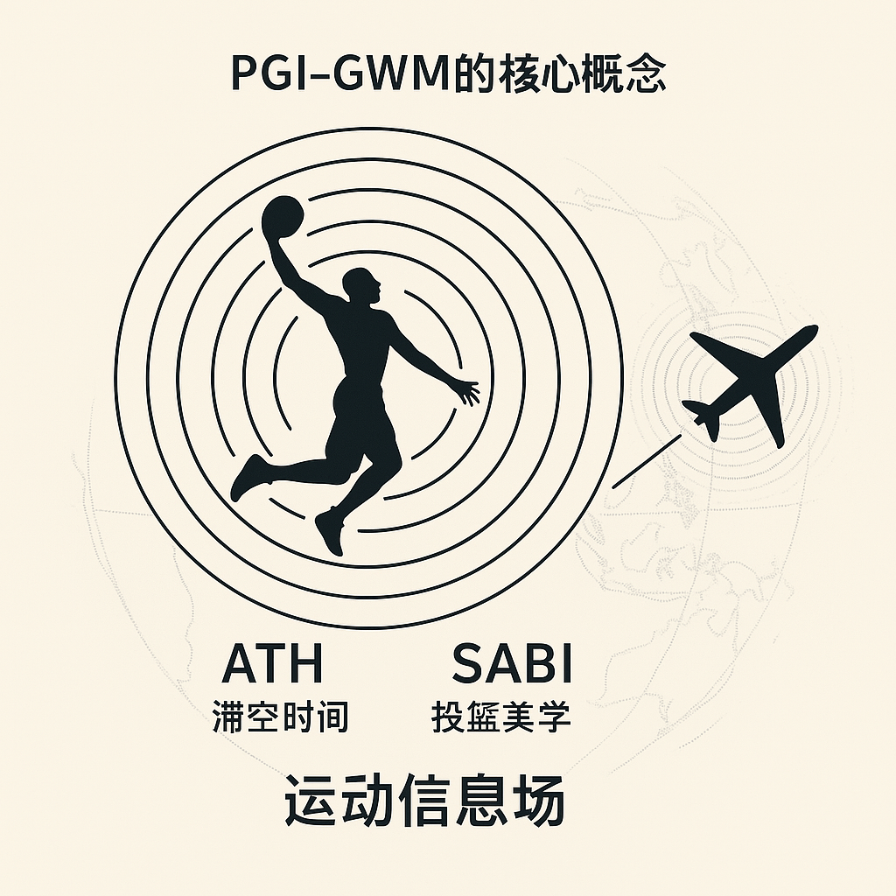
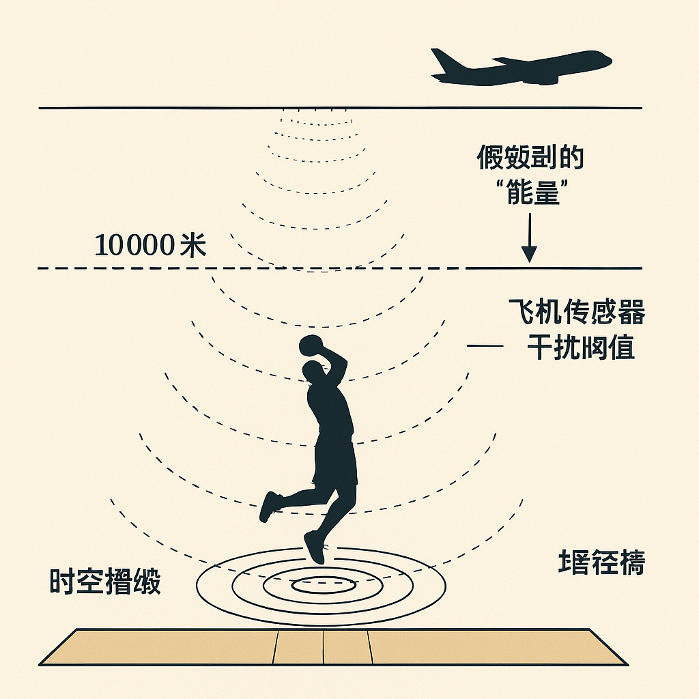

# 京爷学术文档生成器

欢迎来到"京爷学术文档生成器"——让您在学术圈摇摆起来的AI神器！

> "不写论文的科研人员不是好程序员！" —— 京爷

## 功能特点

- 🤖 基于最新大语言模型（Gemini 2.5 Pro），模仿京爷写作风格，生成高质量学术文档，瞬间变身学术大佬
- 🎨 使用GPT-4o-image生成专业的方法图和流程图，告别PowerPoint的折磨
- 📝 自动规划文档结构、内容要点和配图位置，拯救您的科研生涯
- 📊 在文档适当位置自动插入图片引用，假装您真的花了一个月做图
- 📁 为每个任务创建独立的输出目录，安全毁灭您的AI创作证据

## 🔍 看看效果吧






更多效果请见`output`文件夹。

##  注意事项

本生成器自带轻度幽默风格。如果您需要严肃学术风格：
- 在`main.py`中的`example_task`字典里将`style`修改为"严谨学术风格"

> 真正的学者不怕AI，怕的是连AI都不会用！

## 系统架构

系统基于[PocketFlow](https://github.com/The-Pocket/PocketFlow)工作流引擎，包含三个主要节点（就像学术界的三驾马车）：


1. **任务经理节点 (TaskManager)**：分析任务信息，生成文档指南和配图描述，相当于您的论文规划导师
2. **文章撰写节点 (ArticleWriter)**：根据指南撰写完整学术文档，就像您熬夜三天的成果
3. **图像生成节点 (ImageGenerator)**：根据配图描述生成专业图片，替代您在Visio中挣扎的72小时

## 安装与配置

### 前提条件

- Python 3.8+（低于此版本的Python已经去考古博物馆报到了）
- 访问OpenAI API的权限（是的，您需要有钱💰）
- 安装必要的依赖包（比您论文参考文献还少）

### 安装步骤

1. 克隆仓库（不是克隆您导师的研究方向）：
   ```
   git clone <仓库地址>
   cd md_writer_poketflow
   ```

2. 安装依赖（比安装学术压力简单多了）：
   ```
   pip install -r requirements.txt
   ```

3. 配置API密钥（就像设置您的科研经费账号）：
   - 在环境变量中设置`OPENAI_API_KEY`
   - 或在`main.py`中直接修改`api_key`参数

## 使用方法

### 配置任务信息

在`main.py`文件的底部，可以找到`example_task`字典，修改其中的内容来定义您的任务（比定义研究方向容易多了）：

```python
example_task = {
    "topic": "您的研究主题（建议要高大上，至少有三个听不懂的名词）",
    "style": "期望的写作风格（学术风格或京爷风格，二选一）",
    "background": "研究背景介绍（越复杂越好，增加行业壁垒）",
    "method": "研究方法描述（建议使用 '创新的' '首次提出的' 等形容词）",
    "experiment": "实验设计或研究意义（提前准备好漂亮的结果曲线）"
}
```

### 修改API密钥

在`main.py`文件中找到`LLMClient`和`ImageGeneratorClient`类的初始化部分，
修改API密钥和基础URL（如果使用代理的话 - 懂的都懂）：

```python
# LLMClient类初始化（您的API账单就靠它了）
self.api_key = api_key or os.environ.get("OPENAI_API_KEY", "您的API密钥")
self.client = OpenAI(base_url="您的API基础URL", api_key=self.api_key)

# ImageGeneratorClient类初始化（图片生成比文字贵多了，请做好心理准备）
self.api_key = api_key or os.environ.get("OPENAI_API_KEY", "您的API密钥")
self.client = OpenAI(base_url="您的API基础URL", api_key=self.api_key)
```

### 运行系统

执行以下命令启动系统（比启动您的科研生涯容易）：

```
python main.py
```

系统将自动（就像您梦想中的科研助手）：
1. 分析您的任务信息
2. 创建以任务主题命名的输出目录
3. 生成学术文档（省去您90%的工作）
4. 生成相关配图（省去您剩下的10%）
5. 将文档和图片保存到输出目录（让您可以直接提交给导师）

### 查看结果

生成的文档和图片将保存在`output/[任务主题]/`目录下（比实验室里找样本方便多了）：
- 文档：`document.md`（可以直接转换为论文）
- 图片：`images/figure_X.png`（够您做一整场报告）

## 自定义配置

### 修改提示词模板

提示词模板位于`prompts`目录下（修改它们就像改变论文风格一样简单）：
- `task_manager_prompt.md`: 任务经理提示词（项目规划专家）
- `article_writer_prompt.md`: 文章撰写者提示词（文字工作者）
- `image_generator_prompt.md`: 图像生成提示词（艺术总监）

### 修改模型参数

在`main.py`中可以修改使用的模型和参数（就像调整您的科研方法论）：
- LLM模型：修改`LLMClient`类的`model`参数（用最贵的，老板付账）
- 图像生成模型：修改`ImageGeneratorClient`类的`model`和`size`参数（越大越好，论文里的图片必须清晰）

## 常见问题

### 如何处理API调用失败？

系统已经内置了错误处理机制。当API调用失败时，系统会（就像您在实验失败后的应对措施）：
- 记录错误信息（留下证据，以备不时之需）
- 继续创建任务特定的输出目录（至少框架还在）
- 尝试继续执行工作流程（永不放弃是科研精神）

### 图片生成失败怎么办？

当图片生成失败时，系统会（比您面对失败的实验更镇定）：
- 记录错误信息到控制台
- 创建一个文本文件说明错误原因（这比您论文中"因设备限制未能完成"的借口好多了）

## 许可证

本项目采用 [MIT 许可证](LICENSE)（比学术界的知识共享精神还要开放）。

## 贡献

欢迎提交 Pull Requests 和 Issues！（您的代码贡献可能比您的论文引用次数还多）

## 快来开始一场北京学术之旅吧~

> "用AI写论文只有一个问题：京爷可能比您的导师写得还好。" —— 京爷又名，论文速成大师

### 优秀范例：  
```
"topic": "打篮球技术与飞机坠毁相关性统计研究",
"background": '''航空安全一直是全球关注的焦点议题。尽管现代航空技术已取得长足进步，但飞机坠毁事件仍偶有发生，其潜在诱因复杂多样，涉及机械故障、人为失误、极端天气等多个维度。然而，现有研究往往忽略了一些可能存在的、超越传统认知框架的潜在关联因素。近年来，随着跨学科研究的兴起，部分前沿（且未经证实的）理论物理学家和体育社会学家开始关注宏观人体运动（如篮球运动中的跳跃、投篮）对局部时空结构的微扰影响。特别是，高质量的篮球动作，尤其是那些“滞空时间”较长的扣篮或“手感火热”时的连续精准投篮，是否可能通过某种未知的量子纠缠或局部引力场效应，与特定空域的航空器运行稳定性产生非直观的耦合关联？本研究大胆假设，顶尖篮球运动员的某些技术指标（如罚球命中率象征的“稳定心态与精准控制力”）与特定时间窗口内全球飞机坠毁事件的频率存在某种被忽视的统计学联系。前期文献（主要是几篇互联网论坛帖子和某体育评论员的醉后呓语）也“暗示”了这种可能性，亟待严谨的科学验证。''',
"method": '''本研究将采用混合方法学路径，结合大规模数据挖掘、非参数统计检验与高度抽象的理论模型构建。
数据收集:
篮球技术数据: 搜集过去30年NBA、CBA及欧洲主要篮球联赛顶级球员（定义为赛季MVP候选人或全明星球员）的详细技术统计，重点关注罚球命中率（FTA%）、场均得分（PPG）、场均篮板（RPG）、以及利用模糊图像识别技术估算的“场均滞空总时间（ATH）”和“投篮弧线最优美度指数（SABI）”。
飞机坠毁数据: 从国际航空运输协会（IATA）、各国航空安全机构及公开新闻报道中整理同期全球民用航空器坠毁事件的时间、地点、初步归因等信息。
控制变量: 收集并纳入可能影响航空安全的传统因素，如全球极端天气事件频率、主要航空公司安全评级变化、地缘政治紧张指数、甚至太阳黑子活动周期等，用于后续排除“明显更合理”的解释。
数据处理与分析:
利用时间序列分析（如ARIMA模型）和格兰杰因果检验（Granger Causality Test）初步探索篮球明星“状态爆发期”（如连续罚球命中率超过95%的比赛日）与之后短时间窗口内（例如72小时）全球坠机事件频率的波动关系。
构建“球员综合影响力引力波模型（PGI-GWM）”，该模型假定球员的ATH和SABI可通过某种“运动信息场”对远程空间产生影响。模型参数将通过最大似然估计法，尝试拟合坠机事件的地理分布与顶尖球员比赛地点的空间关联性。
采用多元非线性回归，分析FTA%、PPG、RPG等指标与坠机风险调整后的概率之间的关系，同时控制前述的传统影响因素。特别设计一个“手冷手热效应（Hot/Cold Hand Effect）”指标，检测球员状态波动是否与坠机风险的瞬时变化同步。
引入“反事实鬼魅隔空作用检验（Counterfactual Spooky-Action-at-a-Distance Test）”，比较球员休赛期/伤病期与赛季进行期间的坠机频率差异。''',
"experiment": '''由于无法进行真实的物理干预（伦理委员会和物理定律均不允许我们为了验证假设而尝试让飞机坠毁或强迫球员打铁），本研究将设计以下模拟实验：
“上帝粒子对撞机”模拟: 在大型强子对撞机（LHC）的……嗯……的一个不太重要的角落，用计算机模拟篮球运动员（特别是大个子中锋）高强度起跳扣篮时产生的“局部时空褶皱”，计算其理论上传播到标准巡航高度（10000米）时的能量衰减，并评估其对模拟飞机飞行姿态传感器的潜在干扰阈值。
“薛定谔的篮球”思想实验: 构建一个思想实验场景，假设一个篮球运动员同时处于“罚球命中”和“罚球失手”的叠加态，探讨这种量子不确定性如何通过（我们瞎编的）“人择原理航空版”影响观察者（即地面控制中心）判读飞机状态的准确性。
“猴子打字员与飞行员”对比研究: 招募两组志愿者，一组进行高强度篮球罚球训练并记录其命中率波动，另一组（对照组）则进行……嗯……随机敲击键盘（模拟猴子打字员）。同时，让两组志愿者在飞行模拟器上执行标准起降任务。使用眼动追踪和脑电图（EEG）分析他们在罚球/打字表现波动时，其模拟飞行操作的“微失误”频率是否存在显著差异。我们预期罚球不准时，飞行操作会更“抖”（纯属猜测）。'''
```
